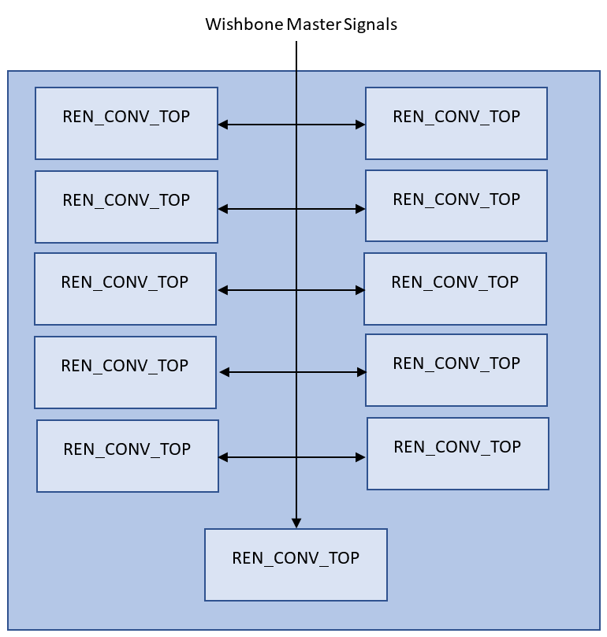
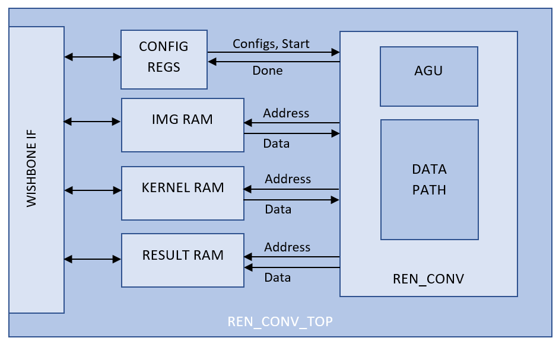

# Renzym Machine Learning Accelerator

  

This repo contains a design to accelerate inference in machine learning problems. 
More specifically, the accelerator offloads and accelerates convolution and max pooling operations. 
Top level wrapper has four identical REN_CONV_TOP cores that are R/W accessible from wishbone master interface.
The main idea is that a processor that wants to offload, writes three rows of an image and a set of kernels that need to be applied on image using wishbone interface to internal memory of accelerator, configures accelerator and kickstarts it. 
Accelerator then performs the configured operations (convolution and maxpool), writes back results to results RAM and asserts a done signal which is readable using wishbone interface. 
The processor can poll done signal and read back result ram for results. 
Since there are four cores, so processor can software pipeline the execution to further optimize time consumed in calculation.

## REN_CONV_TOP Core
Each REN_CONV_TOP Core consists of a register file for configuration and status writes/reads, REN_CONV engine and associated image, kernel and result RAMs.
REN_CONV engine computes 3xN convolution, where N is configurable. This block starts working when start signal is asserted. The address generation unit (AGU) starts generating addresses of image and kernals RAMs, the data from RAMs is forwarded to DATA PATH. It multiplies and accumulates results to calculate convolution result. The convolution result is forwarded to a bypass-able max pool block. If enabled, max pool block forwards max of every pair of values from convolution output. If disabled, data from convolution is forwarded as is. The output of max pool is written to results ram.
Configurations and RAMs are kept external to REN_CONV engine so that this generic block can multiplex between different configurations and data sets. In future implementations, multi-pass operations can be designed to support re-use of outputs as inputs to next pass without disturbing CPU. External config block also ensures that there can be different such blocks for different interfaces (e.g. AXI, Wishbone etc.) without affecting rest of the design.

## Memory Map

The address map for the module is given in the following table.

| **Name** | **Address** | **Accessibility** | **Description** |
| --- | --- | --- | --- |
| **Core 0** |
| Config/Status | 0x30000000-0x3000000C | RW | Control/Status Registers |
| Image RAM | 0x30000100-0x300001FC | W | Image data 3-bytes per word |
| Kernel RAM | 0x30000200-0x300002FC | W | Kernels data 3-bytes per word |
| Result RAM | 0x30000300-0x300003FC | R | Kernels data 1-byte per word |
| **Core 1** |
| Config/Status | 0x3100000-0x3100000C | RW | Control/Status Registers |
| Image RAM | 0x31000100-0x310001FC | W | Image data 3-bytes per word |
| Kernel RAM | 0x31000200-0x310002FC | W | Kernels data 3-bytes per word |
| Result RAM | 0x31000300-0x310003FC | R | Kernels data 1-byte per word |
| **Core 2** |
| Config/Status | 0x32000000-0x3200000C | RW | Control/Status Registers |
| Image RAM | 0x32000100-0x320001FC | W | Image data 3-bytes per word |
| Kernel RAM | 0x32000200-0x320002FC | W | Kernels data 3-bytes per word |
| Result RAM | 0x32000300-0x320003FC | R | Kernels data 1-byte per word |
| **Core 3** |
| Config/Status | 0x33000000-0x3300000C | RW | Control/Status Registers |
| Image RAM | 0x33000100-0x330001FC | W | Image data 3-bytes per word |
| Kernel RAM | 0x33000200-0x330002FC | W | Kernels data 3-bytes per word |
| Result RAM | 0x33000300-0x330003FC | R | Kernels data 1-byte per word |

**Bit-field descriptions for Control/Status Register 0**

| 31 --- 8 | 3 | 2 | 1 | 0 |
| --- | --- | --- | --- | --- |
| Reserved | Soft Reset | Start | Overflow | Done |

Register 0 bit fields description

| **Bit Field** | **Description** |
| --- | --- |
| Done | Status bit showing completion of operation |
| Overflow | Sticky status bit set in case of accumulator overflow |
| Start | Control bit. Set to kickstart operation |
| Soft reset | Resets AGU and Data path registers |

**Bit-field descriptions for Control/Status Register 1**

| 31 --- 24 | 18-16 | 15-8 | 2-0 |
| --- | --- | --- | --- |
| Stride | Kerns | Cols | Kern Cols |

Register 1 bit fields description

| **Bit Field** | **Description** |
| --- | --- |
| Kern Cols | No. of cols of kernel - 1 |
| Cols | No. of columns of image -1 |
| Kerns | No. of kernels-1 |
| Stride | Stride during convolution |

**Bit-field descriptions for Control/Status Register 2**

| 31 --- 21| 20-18 | 17 | 16 | 11-8 | 7-0 |
| --- | --- | --- | --- | --- | --- |
| Reserved | Mask | Kern Address Mode | Shift | Result Cols |

Register 2 bit fields description

| **Bit Field** | **Description** |
| --- | --- |
| Result Cols | No. of cols of result - 1 |
| Shift | Accumulator's result can be shifted to support different Q-formats |
| Kern Address Mode | In mode zero next kernel starts at 4, in mode 1 at 8 |
| Mask | Convolution rows can be masked to support non 3xN convs  |

